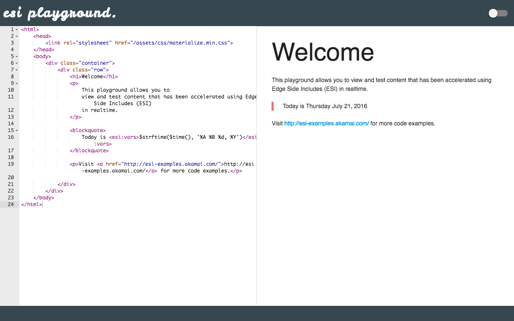

**NOTE : This is a work in progress contributions welcome**

# akamai-ets

`akamai-ets`is a dockerized version of the ETS server provided by Akamai.

> ETS server is a reverse proxy built with Apache and mod_esi that
  can be used to test ESI-enabled content.

## Installation

In order to use `akamai-ets` you must first ensure that you have Docker installed.
Installation instructions can be found [here](https://www.docker.com/products/overview).

Once Docker is installed, you can complete the installation by following the
instructions below.

> **Prerequisite** You will need to obtain a copy of the ETS Server from Akamai initially. Older versions may work with modification but this project has been tested with `akamai-ets_6.0.0.4_Ubuntu.tar.gz`. This needs to be placed in `./files/release`.

```bash
> git clone ssh://git@github.com:newscorpaus/akamai-ets.git && cd akamai-ets
> make install
```

The above will clone `akamai-ets` locally, build an `akamai-ets` image and add
the `akamai-ets` executable to your path for easy access

## Usage

`akamai-ets` is bundled with a command line app to make it much easier for
configuration. It intentionally does not use the bundled `ets-config` configuration
tool. This cli can be seen as a drop-in replacement.

```
 █████╗  ██╗  ██╗  █████╗  ███╗   ███╗  █████╗  ██╗    ███████╗ ████████╗ ███████╗
██╔══██╗ ██║ ██╔╝ ██╔══██╗ ████╗ ████║ ██╔══██╗ ██║    ██╔════╝ ╚══██╔══╝ ██╔════╝
███████║ █████╔╝  ███████║ ██╔████╔██║ ███████║ ██║    █████╗      ██║    ███████╗
██╔══██║ ██╔═██╗  ██╔══██║ ██║╚██╔╝██║ ██╔══██║ ██║    ██╔══╝      ██║    ╚════██║
██║  ██║ ██║  ██╗ ██║  ██║ ██║ ╚═╝ ██║ ██║  ██║ ██║    ███████╗    ██║    ███████║ ██╗
╚═╝  ╚═╝ ╚═╝  ╚═╝ ╚═╝  ╚═╝ ╚═╝     ╚═╝ ╚═╝  ╚═╝ ╚═╝    ╚══════╝    ╚═╝    ╚══════╝ ╚═╝

Usage: akamai-ets [options]

Options:

-o, --origin   Origin server host and port                            [string]
-a, --alias    Origin server aliases                                   [array]
-g, --geo      GEO configuration options                               [array]

 -v, --version  Show version number                                   [boolean]
 -h, --help     Show help                                             [boolean]
```

### Playground

A realtime ESI playground is also provided to learn more about how to use ESI or debug code in realtime.



### origin

The origin option tells ETS which host should be ESI enabled.

```bash
> akamai-ets -o http://192.168.1.1:3000 -g country_code=AUS -g city=SYDNEY
```

### alias

Alternative host names for the origin server which should also be processed. These
are usually requests to external fragments.

### geo

This option permits controlling the GEO settings of the server. They should be added
using the format of `-g <name>=<value>`. Note multiple values can be supplied

```bash
> akamai-ets -o http://status.ets -g country_code=AUS city=SYDNEY
```

Values added via this means will be merged with the GEO defaults

```JavaScript
{
    'georegion'    : '246',
    'country_code' : 'US',
    'region_code'  : 'CA',
    'city'         : 'SANJOSE',
    'dma'          : '807',
    'pmsa'         : '7400',
    'areacode'     : '408',
    'county'       : 'SANTACLARA',
    'fips'         : '06085',
    'lat'          : '37.3353',
    'long'         : '121.8938',
    'timezone'     : 'PST',
    'network_type' : 'dialup'
}
```
> GEO default

GEO can be disabled using `-g false`.

### debug

To see the ESI debug output for an origin server access it using the debug port.

## ports

Ports are dynamically assigned unless overridden by `ETS_PORT` or `ETS_DEBUG_PORT`.

## Environment Variables

Environment Variables can be set to override the default host port and directory
to mount.

- **ETS\_PORT**   : the local port for the ESI playground
- **ETS\_ORIGIN** : the local port of the proxied origin
- **ETS\_DEBUG**  : the local port for debugging the proxied origin
- **ETS\_WWW**    : use the defined path instead of the current directory ( default : $PWD )

## Further reading

For a complete overview of GEO settings and other ESI related items review the Akamai
ETS documentation found [here](https://www.akamai.com/us/en/multimedia/documents/technical-publication/debugging-esi-using-the-esi-test-server.pdf).

- [Akamai ESI](https://www.akamai.com/us/en/support/esi.jsp)

# Contributing

In lieu of a formal styleguide, take care to maintain the existing coding style. Add unit tests for any new or changed functionality. Lint and test your code using npm test / yarn test.

# Release History

- *1.0.0* Initial release

# License

MIT Copyright (c) 2017 News Corp Australia.
